# Microsoft 365 & Entra ID Administration Lab

## Overview
Built and administered a Microsoft 365 
Business Premium tenant from scratch, 
simulating a real enterprise IT environment. 
Configured user lifecycle management, 
identity security, Conditional Access 
policies, and helpdesk ticket workflows 
using Microsoft 365 Admin Center and 
Microsoft Entra ID.

## Environment
- Microsoft 365 Business Premium Trial
- Microsoft Entra ID
- Location: Toronto, Canada

## What I Configured

### User Management
- Created 4 domain users across IT, 
  HR and Finance departments
- Assigned Microsoft 365 Business 
  Premium licenses
- Created security groups (IT-Staff, 
  Finance-Staff)
- Assigned Helpdesk Administrator role
  applying least privilege principle

### Microsoft Entra ID
- Managed cloud identities for all users
- Reviewed user profiles, group memberships,
  license status and sign-in activity
- Configured Self-Service Password Reset 
  (SSPR) for IT-Staff group
- Enabled Microsoft Authenticator and 
  Email OTP as authentication methods

### MFA + Conditional Access
- Created Conditional Access policy:
  Require-MFA-All-Users (report-only)
- Created named location: Allowed-Canada
- Created location-based policy:
  Block-Outside-Canada (report-only)
- Excluded global admin from all policies
  to prevent lockout

### Helpdesk Ticket Simulations
- INC-2026-001: Password reset for locked
  out user (sjohnson) with forced change
  on next login — resolved in 4 minutes
- INC-2026-002: Account disable for employee
  on extended leave (mdavis) using Account
  enabled toggle in Entra ID — resolved 
  in 3 minutes
- Both tickets fully documented with
  timestamped activity logs, resolution
  steps and SLA tracking

### Audit Logs
- Reviewed complete audit trail of 
  all admin actions
- Verified all changes logged with 
  timestamps and admin attribution
- Demonstrated compliance awareness 
  and accountability practices

## Key Learnings
- Conditional Access is the modern 
  replacement for per-user MFA —
  more scalable and policy-driven
- Always exclude global admin from 
  Conditional Access policies to 
  prevent lockout
- Audit logs capture every admin action —
  critical for compliance and 
  incident investigation
- Account disable preserves all data 
  unlike deletion — always preferred 
  for temporary absence scenarios

## Technologies Used
Microsoft 365 Business Premium ·
Microsoft Entra ID · Conditional Access ·
MFA · SSPR · Audit Logs

## Skills Demonstrated
- Microsoft 365 administration
- Microsoft Entra ID 
- Identity and access management (IAM)
- MFA and Conditional Access configuration
- Location-based access control
- Self-Service Password Reset (SSPR)
- Helpdesk ticket documentation (ITIL)
- Audit log review and compliance awareness
- Least privilege role assignment

## Screenshots
| # | Screenshot | Description |
|---|-----------|-------------|
| 01 | tenant-setup | M365 tenant created |
| 02 | users-created | All 4 users with licenses |
| 03 | helpdesk-role-assigned | Least privilege role |
| 04 | security-groups | IT-Staff, Finance-Staff |
| 05 | entra-portal | Entra ID home |
| 06 | entra-user-profile | User identity details |
| 07 | sspr-configured | SSPR for IT-Staff |
| 08 | authentication-methods | Authenticator + Email OTP |
| 09 | mfa-conditional-access | MFA policy |
| 10 | named-location-canada | Canada named location |
| 11 | block-outside-canada | Location block policy |
| 12 | password-reset-confirmation | Reset confirmation |
| 13 | ticket-001-documentation | INC-2026-001 ticket |
| 14 | account-disabled | Mike Davis blocked |
| 15 | ticket-002-documentation | INC-2026-002 ticket |
| 16 | audit-logs | Full audit trail |

## Screenshot Gallery

### Tenant Setup
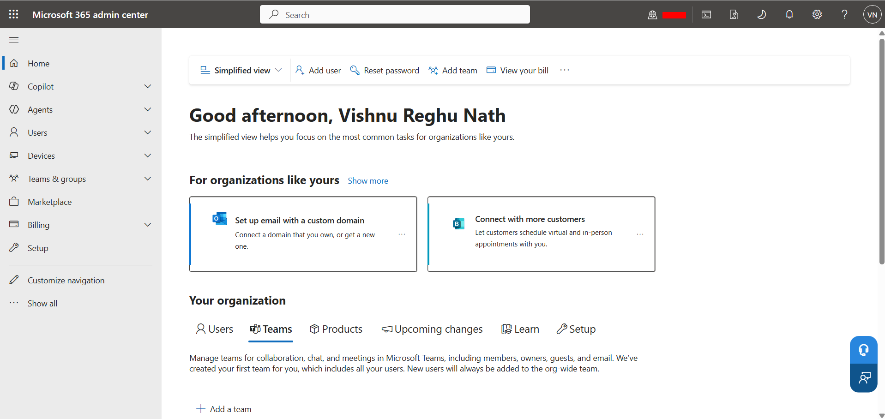

### Users Created
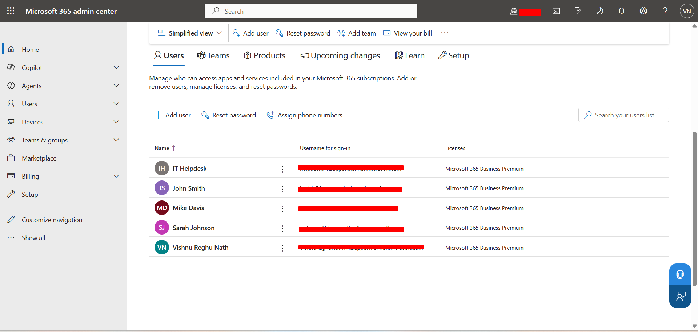

### Helpdesk Role Assigned
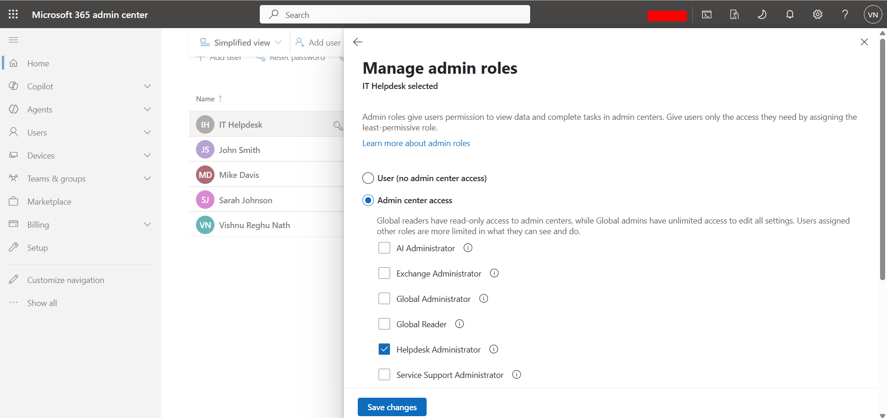

### Security Groups
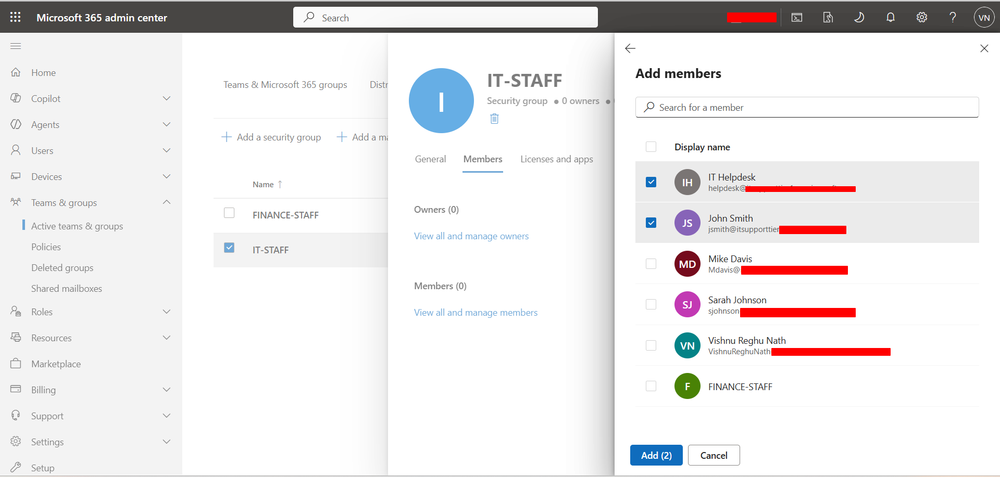

### Entra ID Portal
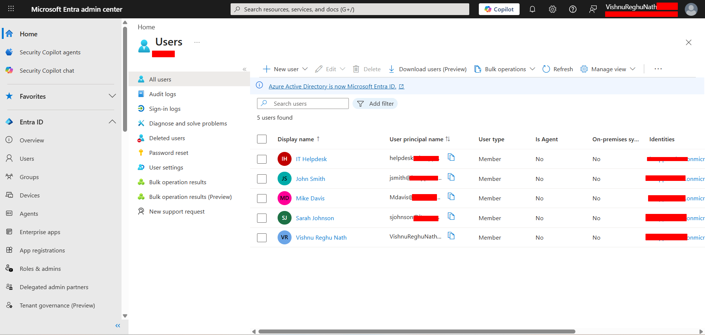

### Entra User Profile
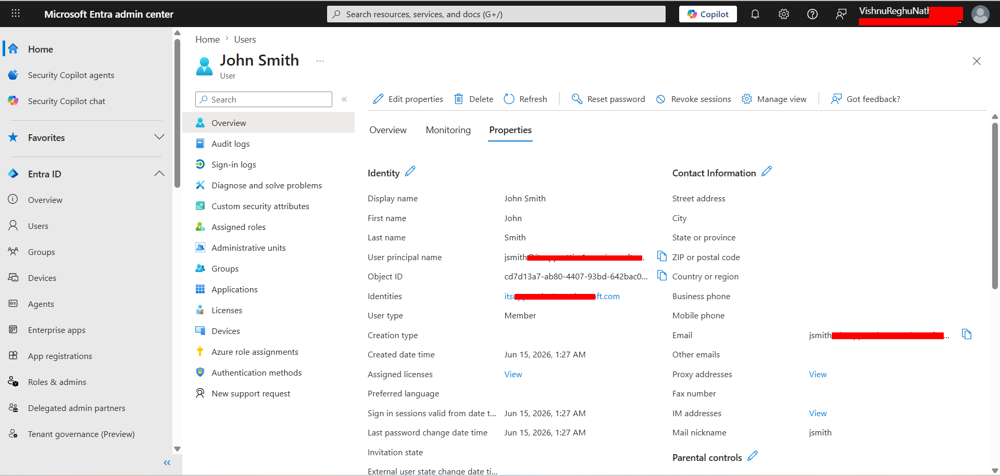

### SSPR Configured
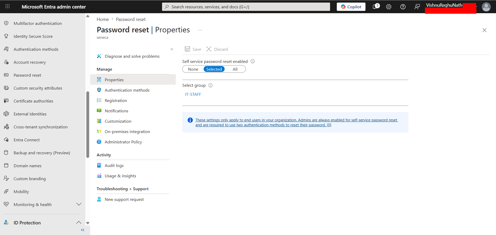

### Authentication Methods
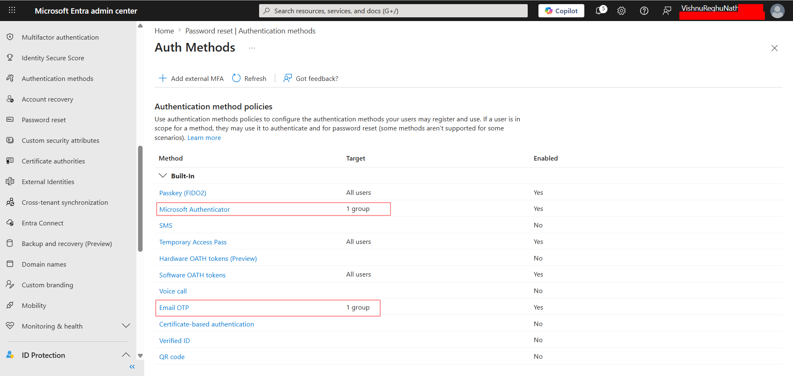

### MFA Conditional Access Policy
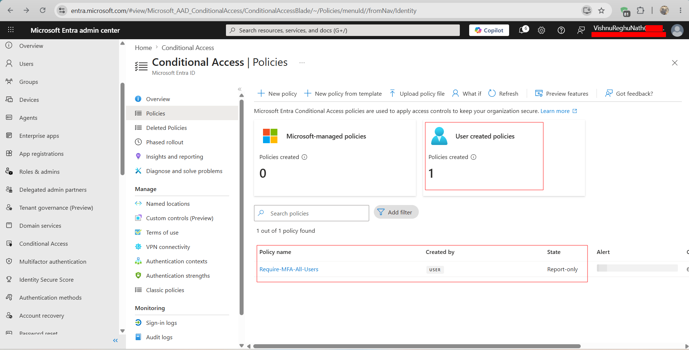

### Named Location Canada
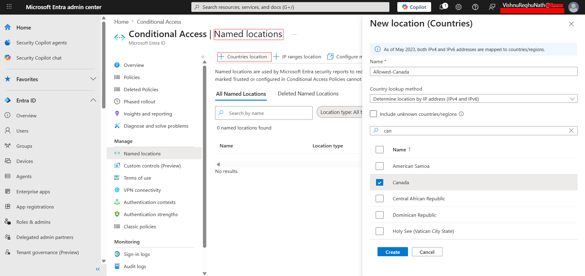

### Block Outside Canada Policy
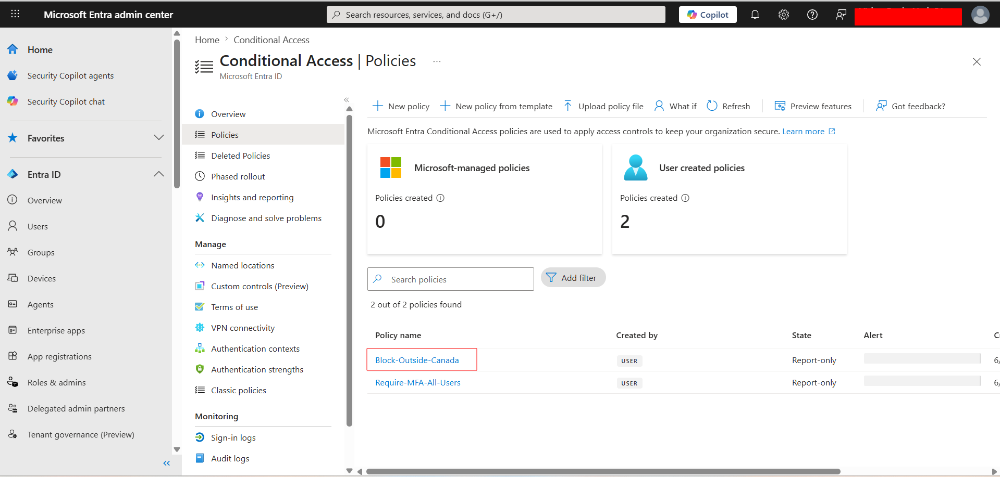

### Password Reset Confirmation
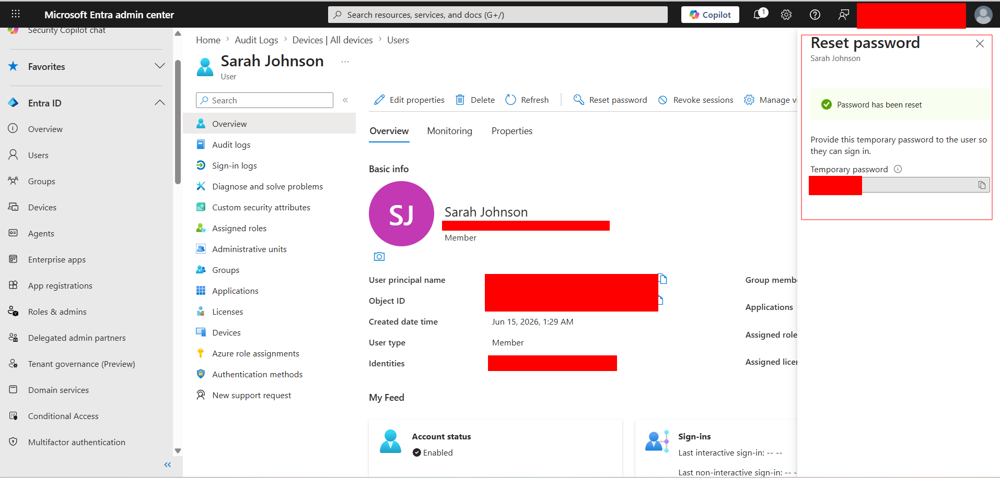

### Ticket 001 Documentation
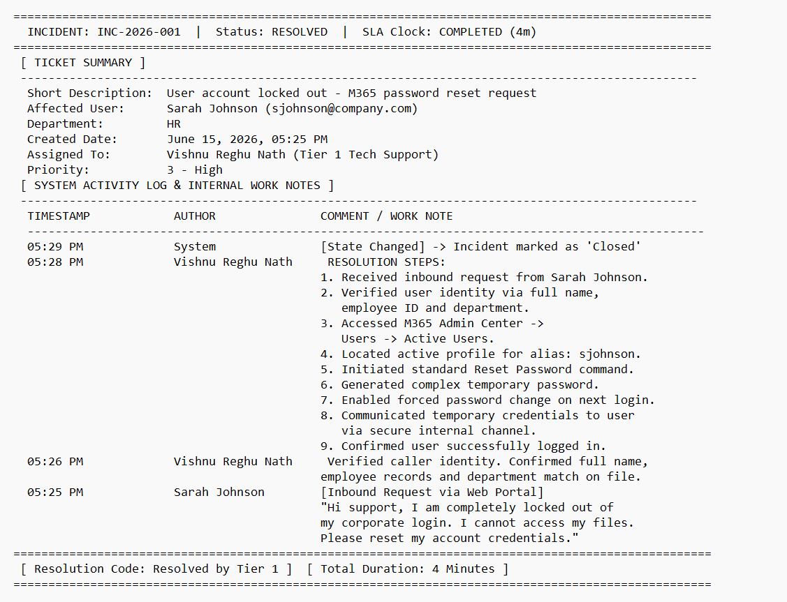

### Account Disabled
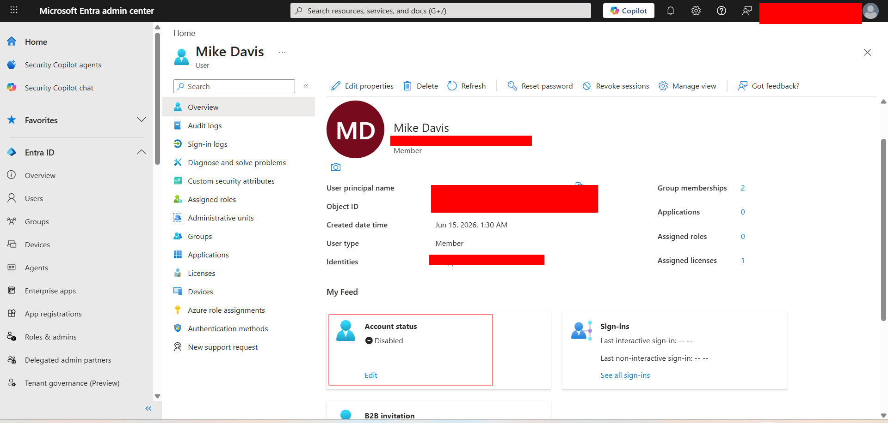

### Ticket 002 Documentation
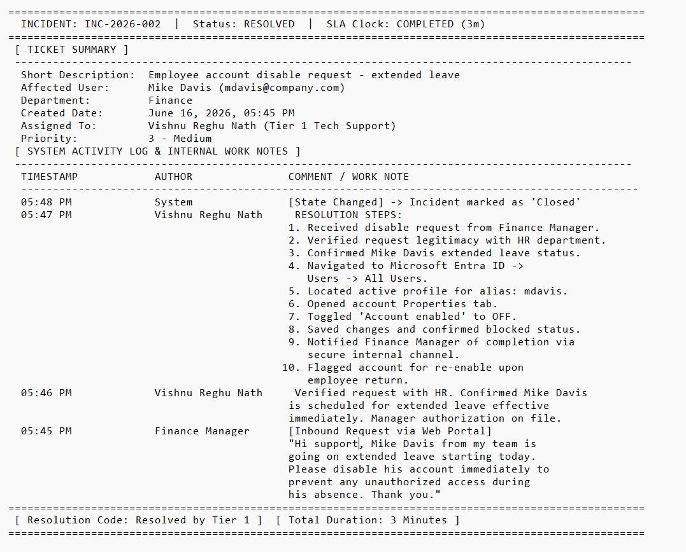

### Audit Logs
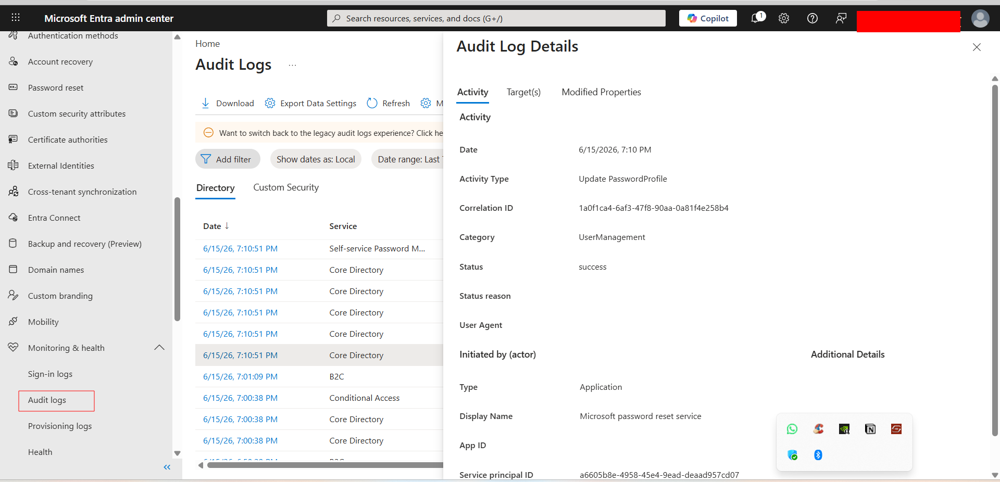
